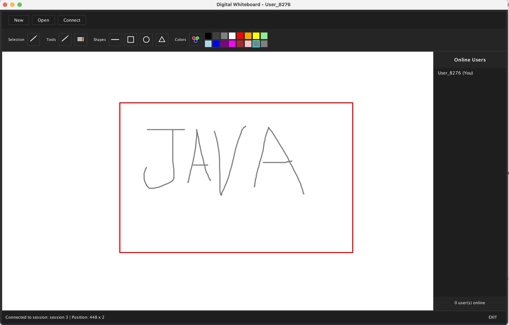

# Real-Time Collaborative Whiteboard

A real-time, multi-user drawing application that functions as a virtual whiteboard. Multiple users can connect to a shared session and draw simultaneously. All strokes, shapes, and actions performed by one user are broadcast in real time to all other participants in the same session.

## Project Overview

This project demonstrates a robust, event-driven architecture focusing on:
- Concurrent user management
- Real-time collaboration
- Persistent storage of shared sessions

## Technologies Used

- **Java Swing** - Graphical user interface
- **Java Networking (Sockets)** - Real-time communication between server and clients
- **Multithreading** - Concurrent user and event handling
- **JDBC + MySQL** - Saving and loading session data

## Project Structure

```
WhiteBoard/
├── src/
│   ├── com/
│   │   └── whiteboard/
│   │       ├── client/                  # Client-side code
│   │       │   ├── ui/                  # GUI components (WhiteboardFrame, DrawCanvas)
│   │       │   └── network/             # Network communication (NetworkHandler)
│   │       ├── server/                  # Server-side code
│   │       │   ├── WhiteboardServer.java
│   │       │   ├── ClientHandler.java
│   │       │   └── Session.java
│   │       ├── common/                  # Shared code between client and server
│   │       │   ├── model/               # Data models (DrawingEvent, etc.)
│   │       │   └── util/                # Utility classes
│   │       └── database/                # Database access layer
│   │           ├── DatabaseManager.java
│   │           └── SessionDAO.java
│   ├── resources/
│   │   ├── database_setup.sql           # SQL script to create database
│   │   └── database.properties          # Database configuration
│   └── test/                            # Unit tests
├── .gitignore
└── README.md
```

## Quick Start with Docker (Recommended)

The easiest way to run the application is using Docker for the server and database.

### 1. Start Server and Database
**Prerequisite:** You must have [Docker Desktop](https://www.docker.com/products/docker-desktop/) installed and running.

This will create a MySQL container and a Server container, linked together.
```bash
docker compose up --build
```
*Note: If `docker compose` doesn't work, try `docker-compose up --build` (older versions).*

Wait until you see `Server started on port 8000` in the logs.

### 2. Run the Client
The client is a desktop GUI application and must be run locally on your machine.
Make sure you have Java (JDK 11+) installed.

**Mac/Linux:**
```bash
./run_client.sh
```

**Windows:**
You can run the commands inside `run_client.sh` manually or use an IDE like Eclipse/IntelliJ.

---

## Setup Instructions

### Prerequisites

- Java JDK 11 or higher
- Eclipse IDE (or any Java IDE)
- MySQL Server 8.0+
- MySQL Connector/J (JDBC driver) - Download from MySQL website

### Database Setup

1. Install and start MySQL server
2. Run the database setup script:
   ```bash
   mysql -u root -p < src/resources/database_setup.sql
   ```
3. Update `src/resources/database.properties` with your database credentials

### Eclipse Setup

1. **Import the Project:**
   - Open Eclipse
   - File → Open Projects from File System
   - Select the WhiteBoard directory
   - Click Finish

2. **Add MySQL Connector/J:**
   - Download MySQL Connector/J from https://dev.mysql.com/downloads/connector/j/
   - Right-click project → Properties → Java Build Path → Libraries
   - Click "Add External JARs" and select the MySQL connector JAR file
   - Click Apply and Close

### Running the Application

1. **Start the Server:**
   - Run: `javac -cp "lib/mysql-connector-j-8.0.33.jar" -d bin $(find src -name "*.java"`
   - Run: `java -cp "bin:lib/mysql-connector-j-8.0.33.jar" com.whiteboard.server.WhiteboardServer`

2. **Start the Client:**
   - Run: `java -cp "bin:lib/mysql-connector-j-8.0.33.jar" com.whiteboard.client.WhiteboardAp`

## System Architecture

### Server Components

- **WhiteboardServer**: Manages client connections and active sessions
- **ClientHandler**: Dedicated thread for handling communication with an individual client
- **Session**: Represents a shared whiteboard where multiple clients can draw together

### Client Components

- **WhiteboardApp**: Main entry point for the client application
- **WhiteboardFrame**: Main graphical interface window
- **DrawCanvas**: The drawing surface that displays all user interactions
- **NetworkHandler**: Handles communication with the server and updates the canvas in real time

## Communication Flow

1. A user draws a line on their canvas
2. The client application captures this action and sends the drawing data to the server
3. The server receives the data and forwards it to all other connected clients in the same session
4. Each client updates its display so that the new drawing appears instantly on all screens

## Features

- Real-time collaborative drawing
- Multiple independent sessions (rooms)
- Drawing tools: Pen, Line, Rectangle, Eraser
- Color selection
- Save and load sessions from database
- Multi-user support with concurrent access
